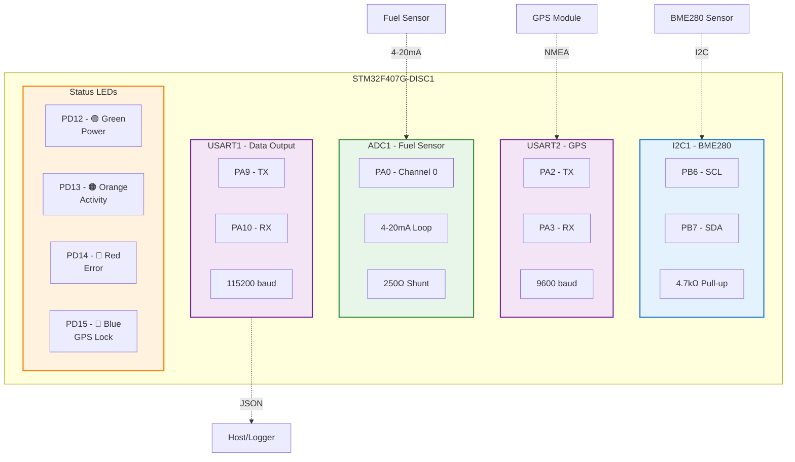
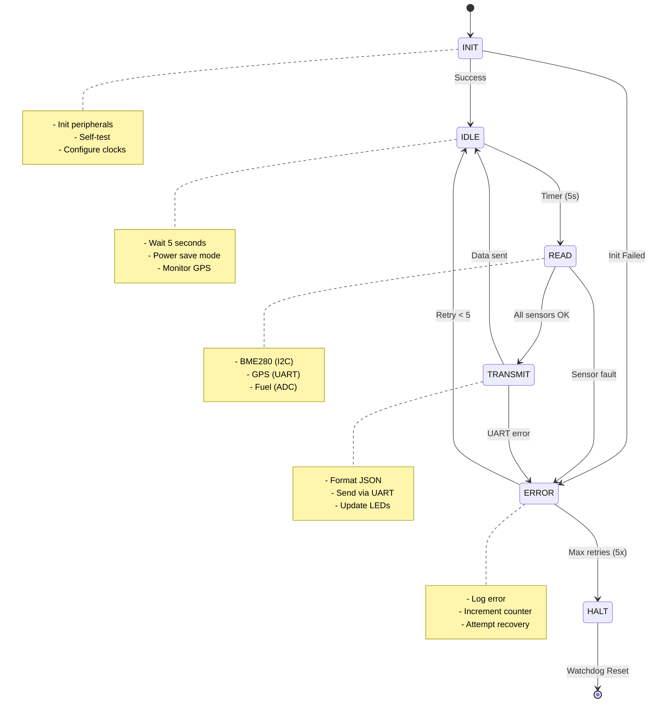
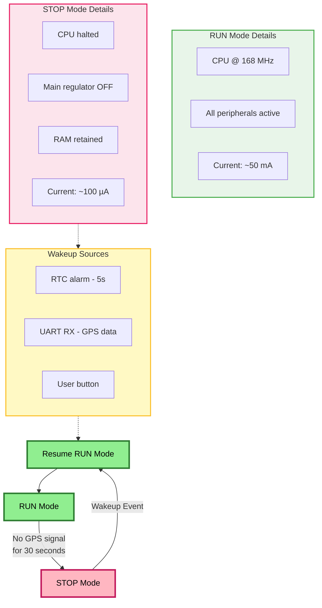
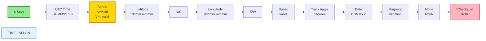
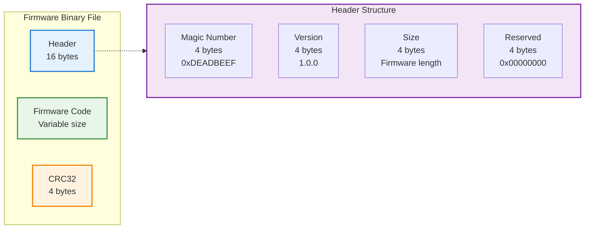
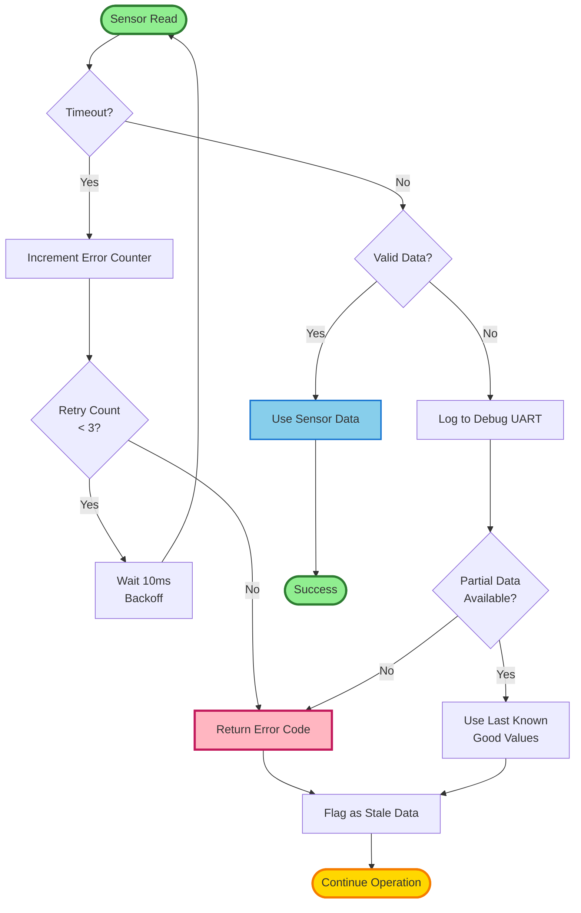

# STM32 Sensor Manager

[](LICENSE)
[](https://www.st.com/en/microcontrollers-microprocessors/stm32f407vg.html)
[](docs/ARCHITECTURE.md)

A production-grade firmware solution for STM32F407VGTx microcontroller that manages multi-sensor data acquisition with robust error handling, power management, and real-time GPS integration.

## 🎯 Features

### Core Capabilities
- **Multi-Sensor Integration**: BME280 (I2C), GPS NMEA (UART), 4-20mA Fuel Sensor (ADC)
- **State Machine Architecture**: Deterministic INIT → IDLE → READ → TRANSMIT flow
- **Power Optimization**: Automatic STOP mode with 30-second inactivity timeout
- **Robust Error Handling**: I2C timeout recovery, GPS checksum validation, ADC range checking
- **Structured Data Output**: JSON-formatted sensor telemetry via UART
- **Visual Diagnostics**: 4-LED status indicator system

### Safety & Reliability
- Flash write endurance management
- Critical data backup to RTC registers
- Watchdog timer integration
- State machine error recovery (max 5 retries)
- Power loss survival strategy

---

## 📋 Table of Contents

- [Hardware Specifications](#-hardware-specifications)
- [Quick Start](#-quick-start)
- [Architecture](#-architecture)
- [Data Format](#-data-format)
- [Configuration](#%EF%B8%8F-configuration)
- [Building](#-building-the-firmware)
- [LED Diagnostics](#-led-diagnostics)
- [Error Handling](#-error-handling)
- [Documentation](#-documentation)
- [License](#-license)

---

## 🔧 Hardware Specifications

### Target Platform

| Component | Specification |
|-----------|--------------|
| **MCU** | STM32F407VGTx |
| **Development Board** | STM32F407G-DISC1 |
| **Core** | ARM Cortex-M4F @ 168 MHz |
| **Flash Memory** | 1024 KB |
| **SRAM** | 128 KB + 64 KB CCM |
| **Operating Voltage** | 3.3V |

### Peripheral Configuration

#### 🌡️ BME280 Environmental Sensor (I2C1)
- **Interface**: I2C @ 100 kHz
- **Address**: 0x76 or 0x77
- **Pins**: 
  - `PB6` → SCL
  - `PB7` → SDA
- **Pull-up**: 4.7 kΩ (calculated for 100 pF bus capacitance)
- **Measurements**: Temperature, Pressure, Humidity

#### 🛰️ GPS Module (USART2)
- **Interface**: UART @ 9600 baud
- **Protocol**: NMEA 0183 ($GPRMC sentences)
- **Pins**:
  - `PA2` → TX
  - `PA3` → RX
- **Features**: Checksum validation, fix status detection

#### ⛽ Fuel Level Sensor (ADC1)
- **Interface**: 12-bit ADC
- **Input**: 4-20 mA current loop
- **Shunt Resistor**: 250 Ω (1.0V - 5.0V output)
- **Pin**: `PA0` (Channel 0)
- **Range**: 0-100% fuel level

#### 💡 Status LEDs (GPIO)
| LED | Pin | Color | Function |
|-----|-----|-------|----------|
| LED4 | PD12 | 🟢 Green | System Power/Run |
| LED3 | PD13 | 🟠 Orange | Activity (Sensor Read) |
| LED5 | PD14 | 🔴 Red | Error State |
| LED6 | PD15 | 🔵 Blue | GPS Lock (3D Fix) |

#### 📡 Data Output (USART1)
- **Interface**: UART @ 115200 baud, 8N1
- **Pins**:
  - `PA9` → TX (JSON sensor data)
  - `PA10` → RX
- **Format**: JSON telemetry (see [Data Format](#-data-format))

### Pin Mapping Diagram



### I2C Pull-up Resistor Calculation

For reliable I2C operation at 100 kHz:

```
Given:
  - Rise time (t_r) = 1000 ns (I2C standard mode)
  - Bus capacitance (C_bus) ≈ 100 pF (estimated)

Formula:
  R_pullup = t_r / (0.8473 × C_bus)
           = 1000 ns / (0.8473 × 100 pF)
           ≈ 11.8 kΩ

Selected: 4.7 kΩ (conservative margin for short PCB traces)
```

---

## 🚀 Quick Start

### Prerequisites

- **Hardware**: STM32F407G-DISC1 development board
- **Software**: 
  - STM32CubeIDE 1.10.0+ **OR** ARM GCC Toolchain
  - ST-Link drivers
  - Python 3.8+ (for firmware preparation scripts)

### Flash & Run

1. **Clone the repository**
   ```bash
   git clone https://github.com/yourusername/FirmwareEngineer_AhmadZainulArifin_TransTrack.git
   cd FirmwareEngineer_AhmadZainulArifin_TransTrack
   ```

2. **Build the firmware** (see [Building](#-building-the-firmware))

3. **Flash to board**
   ```bash
   # Using ST-Link
   st-flash write Debug/sensor_manager.bin 0x8000000
   
   # Or via STM32CubeIDE: Run → Debug (F11)
   ```

4. **Connect UART** (115200 baud, 8N1) to view JSON output

---

## 🏗️ Architecture

### State Machine Diagram



### Power Management Flow



**Power Consumption Estimates:**
- **Active Mode**: ~50 mA @ 3.3V (165 mW)
- **STOP Mode**: ~100 µA @ 3.3V (0.33 mW)
- **Battery Life** (2500 mAh @ 3.7V):
  - Continuous run: ~50 hours
  - With 50% duty STOP mode: ~120 hours
  - With 80% duty STOP mode: ~200 hours

---

## 📊 Data Format

### JSON Sensor Telemetry (USART1 Output)

**Format**: Newline-delimited JSON (115200 baud, 8N1)

```json
{
  "timestamp": 1234567890,
  "bme280": {
    "temp": 25.4,
    "press": 101325,
    "hum": 60.2
  },
  "gps": {
    "valid": true,
    "time": "123456.00",
    "date": "010226",
    "lat": -6.2088,
    "lon": 106.8456,
    "speed": 0.0
  },
  "fuel": {
    "level": 75.5,
    "voltage": 2.5,
    "current": 12.0
  },
  "status": "OK"
}
```

**Field Descriptions:**

| Field | Unit | Range | Description |
|-------|------|-------|-------------|
| `timestamp` | Unix epoch | 0 - 2³² | System timestamp (seconds) |
| `bme280.temp` | °C | -40 to 85 | Ambient temperature |
| `bme280.press` | Pa | 30000 to 110000 | Atmospheric pressure |
| `bme280.hum` | % | 0 to 100 | Relative humidity |
| `gps.valid` | boolean | true/false | GPS fix status (A=valid) |
| `gps.time` | HHMMSS.SS | - | UTC time from satellite |
| `gps.date` | DDMMYY | - | UTC date |
| `gps.lat` | degrees | -90 to 90 | Latitude (negative = South) |
| `gps.lon` | degrees | -180 to 180 | Longitude (positive = East) |
| `gps.speed` | knots | 0+ | Ground speed |
| `fuel.level` | % | 0 to 100 | Fuel tank fill percentage |
| `fuel.voltage` | V | 1.0 to 5.0 | ADC voltage reading |
| `fuel.current` | mA | 4 to 20 | Loop current |
| `status` | string | OK/ERROR | System health status |

### GPS NMEA Input (USART2)

**Supported Sentence**: `$GPRMC` (Recommended Minimum)

```
$GPRMC,123456.00,A,0607.1234,S,10645.7890,E,0.0,0.0,010226,,,A*6F
```

**Field Breakdown:**



**Example Parsing:**
| Field | Value | Meaning |
|-------|-------|---------|
| UTC Time | `123456.00` | 12:34:56.00 UTC |
| Status | `A` | Valid (Active) |
| Latitude | `0607.1234,S` | 6°07.1234' South = -6.1187° |
| Longitude | `10645.7890,E` | 106°45.7890' East = 106.7632° |
| Speed | `0.0` | 0.0 knots |
| Track | `0.0` | 0.0° |
| Date | `010226` | 01 Feb 2026 |
| Mode | `A` | Autonomous |
| Checksum | `6F` | XOR validation |

**Checksum Validation**: XOR of all bytes between `$` and `*`

---

## ⚙️ Configuration

Edit `Inc/config.h` to customize system behavior:

### Timing Parameters

```c
#define SENSOR_READ_INTERVAL_MS    5000   // Sensor polling period (ms)
#define STOP_MODE_TIMEOUT_MS       30000  // Inactivity timeout for low power (ms)
#define WATCHDOG_TIMEOUT_MS        10000  // IWDG timeout (ms)
```

### Communication Settings

```c
#define BME280_I2C_TIMEOUT         100    // I2C transaction timeout (ms)
#define GPS_UART_BAUDRATE          9600   // GPS module baud rate
#define DATA_UART_BAUDRATE         115200 // JSON output baud rate
#define GPS_CHECKSUM_ENABLE        1      // Enable NMEA checksum validation
```

### Sensor Calibration

```c
#define FUEL_ADC_MIN_VOLTAGE       1.0f   // 4mA @ 250Ω (V)
#define FUEL_ADC_MAX_VOLTAGE       5.0f   // 20mA @ 250Ω (V)
#define FUEL_LEVEL_MIN_PERCENT     0.0f   // Empty tank
#define FUEL_LEVEL_MAX_PERCENT     100.0f // Full tank
```

### Error Handling

```c
#define MAX_CONSECUTIVE_ERRORS     5      // State machine error threshold
#define I2C_RETRY_COUNT            3      // BME280 read retries
#define GPS_INVALID_SENTENCE_LOG   1      // Log invalid NMEA sentences
```

---

## 🔨 Building the Firmware

### Option 1: STM32CubeIDE (Recommended)

1. **Import Project**
   - File → Open Projects from File System
   - Select repository root directory
   - Click Finish

2. **Build**
   ```
   Project → Build All (Ctrl+B)
   ```
   Output: `Debug/sensor_manager.elf`

3. **Flash & Debug**
   ```
   Run → Debug (F11)
   ```

### Option 2: Command Line (ARM GCC)

The project uses STM32CubeIDE's managed build system. For command-line builds:

```bash
# Ensure arm-none-eabi-gcc is in PATH
arm-none-eabi-gcc --version

# Build using generated makefile
cd Debug
make clean
make -j4

# Convert to binary
arm-none-eabi-objcopy -O binary sensor_manager.elf sensor_manager.bin
```

### Firmware Preparation (Production)

Add version header and CRC32 checksum:

```bash
# Generate versioned binary with CRC
python scripts/prepare-firmware.py \
    Debug/sensor_manager.elf \
    sensor_manager_v1.0.0.bin

# Verify firmware integrity
python scripts/prepare-firmware.py \
    sensor_manager_v1.0.0.bin \
    --verify
```

**Binary Format Structure:**



---

## 💡 LED Diagnostics

### Normal Operation Pattern

| State | Green (PWR) | Orange (ACT) | Red (ERR) | Blue (GPS) |
|-------|-------------|--------------|-----------|------------|
| **Startup** | Blink 2 Hz | OFF | OFF | OFF |
| **Idle** | ON | OFF | OFF | Blink (no fix) |
| **Reading** | ON | Blink 5 Hz | OFF | ON (with fix) |
| **Transmit** | ON | ON | OFF | ON (with fix) |
| **Error** | Blink 1 Hz | OFF | ON | OFF |
| **STOP Mode** | OFF | OFF | OFF | OFF |

### Error Code Blink Patterns

Red LED blinks indicate specific errors:

| Blinks | Pause | Error Type |
|--------|-------|------------|
| 1 | 2s | I2C timeout (BME280) |
| 2 | 2s | GPS checksum failure |
| 3 | 2s | ADC out of range |
| 4 | 2s | UART transmission error |
| 5 | 2s | State machine fault |

**Example**: 3 blinks → Fuel sensor current not in 4-20 mA range

---

## 🛡️ Error Handling

### Fault Detection & Recovery



### Error Categories

#### 1. I2C Communication Errors
- **Timeout**: 100ms threshold for BME280 transactions
- **Recovery**: 3 automatic retries with 10ms backoff
- **Fallback**: Use last known good values, flag as stale

#### 2. GPS Errors
- **Invalid Checksum**: Discard sentence, increment counter
- **No Fix** (`V` status): Continue operation, set `gps.valid = false`
- **Timeout**: 30s without data triggers STOP mode

#### 3. ADC Errors
- **Out of Range**: Current < 4 mA or > 20 mA
- **Action**: Set `fuel.level = -1` (error indicator)
- **Logging**: Record anomaly count

#### 4. State Machine Errors
- **Max Retries**: 5 consecutive failures → Enter ERROR state
- **Recovery**: Soft reset, re-initialize peripherals
- **Ultimate Fail-Safe**: Watchdog reset after 10s

### Debug Logging

When `DEBUG` is defined, errors are logged to USART1:

```
[ERROR] BME280 I2C timeout at 00:05:23.456
[WARN] GPS checksum mismatch: expected 0x6F, got 0x5A
[INFO] Entering STOP mode due to GPS inactivity
```

---

## 📚 Documentation

- **[ARCHITECTURE.md](docs/ARCHITECTURE.md)**: Detailed system design, state machines, power management
- **[TESTING.md](docs/TESTING.md)**: Unit tests, integration tests, hardware validation
- **[API.md](docs/API.md)**: Function reference, data structures, peripheral APIs
- **[CHANGELOG.md](CHANGELOG.md)**: Version history and release notes

### Additional Resources
- [STM32F407VG Datasheet](https://www.st.com/resource/en/datasheet/stm32f407vg.pdf)
- [BME280 Sensor Documentation](https://www.bosch-sensortec.com/products/environmental-sensors/humidity-sensors-bme280/)
- [NMEA 0183 Protocol Specification](https://www.nmea.org/content/STANDARDS/NMEA_0183_Standard)

---

## 📋 Version History

| Version | Date | Author | Changes |
|---------|------|--------|---------|
| **1.0.0** | 2026-02-02 | Ahmad Zainul Arifin | Initial production release |
| **0.9.0** | 2026-01-25 | Ahmad Zainul Arifin | Beta testing phase |
| **0.5.0** | 2026-01-15 | Ahmad Zainul Arifin | Alpha prototype |

See [CHANGELOG.md](CHANGELOG.md) for detailed release notes.

---

## 🤝 Contributing

This project is developed as a technical assessment for TransTrack. External contributions are not currently accepted.

### For Code Reviewers

To evaluate this project:

1. **Check code quality**: Run static analysis with `cppcheck` or `clang-tidy`
2. **Verify documentation**: Ensure all functions have Doxygen comments
3. **Test on hardware**: Follow Quick Start guide to flash and validate
4. **Review power consumption**: Measure current draw in RUN and STOP modes

---

## 📄 License

This project is provided **as-is** for technical assessment purposes.

**Copyright © 2026 Ahmad Zainul Arifin**

*Not licensed for commercial use without explicit permission.*

---

## 👤 Author

**Ahmad Zainul Arifin**  
Firmware Engineer Candidate  
📧 Email: [ahmadzainularifin6@gmail.com](mailto:ahmadzainularifin6@gmail.com)  
🔗 LinkedIn: [www.linkedin.com/in/ahmad-zainul-9360a7274](https://linkedin.com/in/yourprofile)  
💻 GitHub: [github.com/keyzoo0](https://github.com/Keyzoo0)

---

## 🙏 Acknowledgments

- **TransTrack Indonesia**: For the technical challenge opportunity
- **STMicroelectronics**: STM32CubeF4 HAL/LL drivers
- **Bosch Sensortec**: BME280 sensor library integration

---

<div align="center">

**Built with ❤️ and ⚡ for embedded systems excellence**

[Report Bug](https://github.com/yourusername/repo/issues) · [Request Feature](https://github.com/yourusername/repo/issues) · [Documentation](docs/ARCHITECTURE.md)

</div>
